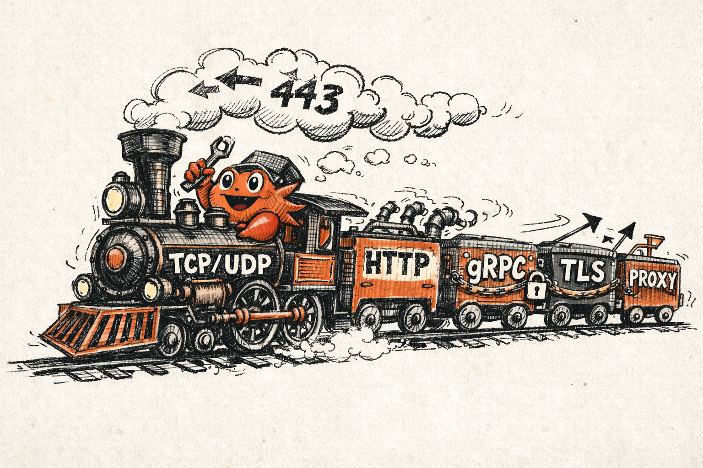
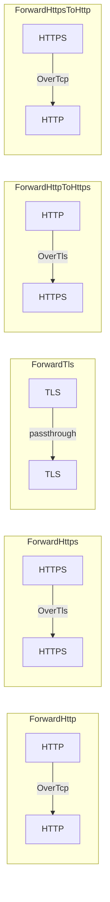
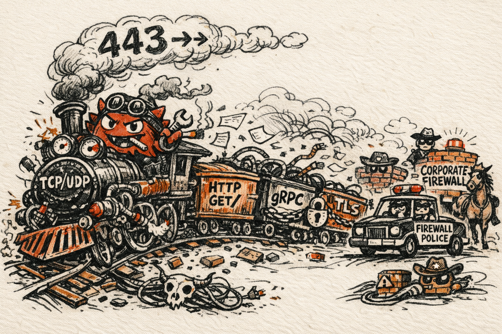

# Railscale

<p align="center">
  
</p>

Insanely fast (really) streaming proxy/dns/packet capture/maybe even firewall service.
For now it supports http header remapping and routing.
Everything is named after railway things
- Very WIP

# Goals
- HTTP 1.0, HTTP1.1, HTTP2, HTTP3 support
- Multiplexed streams
- Keepalive support
- Load Balancing capabilities (reverse too)
- DNS over TLS
- TLS 1.3 support
- DynDNS
- Fully erasable types, 0 overhead abstractions
- Correctness
- Comfortable tailscale integration

# Normal usage
- Custom DNS
- Reverse proxy
- Packet capture/logging
- request matchers
- Basic firewall
- dev/tun mode maybe idk

# Metrics & Tracing
- OTEL
- Logging features

# Benchmarking
- Run the shell script

# Architecture
Railscale is very complex, (mainly because I wanted the entire network layer to be statically monomorphic) compared to what one would expect from a proxy. The reason being is that railscale doesnt buffer requests in memory, and is tuned for maximum performance.
The architecture is also designed to be extensible for basically any network related application.

**(And now claude also fucked it up a bit)**

### Railscale mental model

Everything in railscale is named after railway components. The proxy models itself as a train network — traffic is cargo moving through tracks, switches, and carriages.

## How it works

A request flows through the system like cargo through a rail network:

### Request path


**Concrete example (HTTP reverse proxy):**
- `StreamSource` → `TcpSource` listening on `:8080`
- `FrameParser` → `HttpParser` emits `HttpFrame` per request line, header, body chunk
- `ConnectionHook` → `HttpDeriverHook` extracts HTTP version, body framing, detects CL-TE smuggling
- `FramePipeline` → `HttpPipeline` strips hop-by-hop headers (Connection, TE, Upgrade...)
- `DestinationRouter` → `TcpRouter` connects to `10.0.0.5:80`
- `Stabling` → reuses pooled upstream connections

### Response path

```mermaid
flowchart TD
    SD["StreamDestination"] -->|upstream bytes| RP["ResponseParser\n<i>Return cargo inspector</i>"]
    RP -->|response frames| RPL["ResponsePipeline\n<i>Return assembly line</i>"]
    RPL --> BW["BatchWriter\n<i>Loading dock — 32KB chunks</i>"]
    BW -->|TCP| Client([Client])
    Client --> KA{keep-alive?}
    KA -->|yes| ST["Stabling\n<i>pool connection, loop</i>"]
    KA -->|no| CL["Close\n<i>teardown</i>"]

    style RP fill:#2d3a4a,stroke:#4a6a8a
    style RPL fill:#2d3a4a,stroke:#4a6a8a
    style BW fill:#4a3a2d,stroke:#8a6a4a
    style ST fill:#3a2d4a,stroke:#6a4a8a
```



### Abstraction map

```mermaid
flowchart LR
    subgraph Orchestration
        P["Pipeline\n<i>Src, Par, Pip, Rtr, Hook, RPar</i>"]
    end

    subgraph "Frame transforms"
        SR["SwitchRail\n<i>Frame → Frame</i>\nsync transform\n\ne.g. IdentityRail"]
        T["Turnout\n<i>Frame → Option&lt;Frame&gt;</i>\nfilter + switch\n\ne.g. SimpleTurnout"]
        SR -.->|used by| T
    end

    subgraph Routing
        SH["Shunt\n<i>routing_key → Departure</i>\nasync connect\n\ne.g. RouterShunt"]
    end

    subgraph Transport
        DEP["Departure\n<i>Bytes → async send</i>\n\ne.g. StreamDeparture"]
        TL["Transload\n<i>Frame → Channel</i>\nside output\n\ne.g. ChannelTransload"]
        SHU["Shuttle\n<i>bidirectional link</i>\ntwo-way comms\n\ne.g. ShuttleLink"]
    end

    subgraph "Derive system"
        DF["DerivationFormula\n<i>Inspection rules</i>"] --> DS["DeriverSession\n<i>Accumulator</i>"]
        DS --> DE["DerivedEffect\n<i>Decision</i>"]
    end

    style SR fill:#2d4a2d,stroke:#4a7a4a
    style T fill:#2d4a2d,stroke:#4a7a4a
    style SH fill:#3a2d4a,stroke:#6a4a8a
    style DEP fill:#4a3a2d,stroke:#8a6a4a
    style TL fill:#4a3a2d,stroke:#8a6a4a
    style SHU fill:#4a3a2d,stroke:#8a6a4a
    style DF fill:#2d3a4a,stroke:#4a6a8a
    style DS fill:#2d3a4a,stroke:#4a6a8a
    style DE fill:#2d3a4a,stroke:#4a6a8a
```



### Derive system detail

```mermaid
flowchart LR
    M1["HeaderName\n('content-length')"] -->|"'42'"| S["DeriverSession"]
    M2["HeaderName\n('transfer-encoding')"] -->|"'chunked'"| S
    M3["RequestLineVersion"] -->|"'HTTP/1.1'"| S
    S --> E["DerivedEffect"]
    E --> BF["body_framing:\nChunked | ContentLength | UntilClose"]
    E --> CM["connection:\nKeepAlive | Close"]
    E --> CF["conflicts:\nCL+TE → reject 400"]

    style S fill:#2d3a4a,stroke:#4a6a8a
    style E fill:#4a3a2d,stroke:#8a6a4a
```



### Composing a proxy (Conductor API)

```rust
Conductor::tcp("0.0.0.0:8080")           // StreamSource: listen on TCP
    .route_to("upstream.local:3000")      // DestinationRouter: fixed destination
    .with_keepalive()                     // Enable connection pooling (Stabling)
    .run()                                // Assemble Pipeline and start serving
    .await
```

### Composing with Coupler (protocol flows)



## Glossary

### Crates

| Name | Train meaning | Role |
|------|--------------|------|
| **railscale** | Rail + scale | The workspace — a scalable rail network |
| **train_track** | The track/rails | Core abstractions that everything runs on |
| **carriage** | Passenger/freight car | HTTP protocol (codec, parser, pipeline) + TCP transport |
| **trezorcarriage** | Armored vault car (trezor = safe 🇭🇺) | TLS handling — parsing, passthrough, termination |
| **conductor** | Train conductor | Orchestrator — assembles components into a running proxy |
| **coupler** | Device connecting cars | Joins protocols together (HTTP↔HTTPS, TCP↔TLS, etc.) |
| **bogie** | Wheeled truck under a car | Test harness + benchmarks |

### Core concepts (train_track)

| Name | Train meaning | Role |
|------|--------------|------|
| **Frame** | Structural skeleton of a car | Core data unit flowing through the system |
| **FrameParser** | Cargo inspector | Parses raw bytes into typed frames |
| **FramePipeline** | Assembly line on the railway | Processes frames through a sequence of transformations |
| **Pipeline** | The full transport route | High-level source → parse → route → destination config |
| **Service** | Scheduled train service | Main abstraction for running a proxy |
| **Turnout** | Track switch/junction | Routes frames to different destinations based on conditions |
| **SwitchRail** | Movable rail in a turnout | Trait for routing/switching decisions |
| **IdentityRail** | Straight track (no switch) | No-op pass-through rail |
| **Shunt** | Moving a car to another track | Routes frames with optional transformation |
| **RouterShunt** | Shunting with a route plan | Shunt implementation using a router |
| **Shuttle** | Back-and-forth train service | Bidirectional link for sending frames both ways |
| **ShuttleLink** | Connection for shuttle service | Channel pair for bidirectional communication |
| **Stabling** | Parking trains in a depot | Connection pooling/reuse |
| **Departure** | Train leaving the station | Outgoing data stream to a destination |
| **Transload** | Cargo transfer between trains | Transfer of data between formats/systems |
| **StreamSource** | Origin station | Incoming stream of connections |
| **StreamDestination** | Terminal station | Outgoing stream endpoint |
| **DestinationRouter** | Route dispatcher | Routes frames to the correct destination |
| **ConnectionHook** | Coupling point | Intercepts connection lifecycle events |

### Data model

| Name | Train meaning | Role |
|------|--------------|------|
| **FramePhase** | Phase of the journey | Processing stage a frame is in |
| **PhasedFrame** | Car at a station | Frame tagged with its current phase |
| **PhasedBuffer** | Staging yard | Buffered frames organized by phase |
| **RawFrame** | Uninspected cargo | Unprocessed frame data |
| **ParsedData** | Inspected/sorted cargo | Frame data after parsing |
| **MatchAtom** | Cargo label | Smallest matchable unit in a frame |
| **DerivedEffect** | Routing decision from cargo inspection | Effect derived from frame analysis |
| **DerivationFormula** | Inspection rulebook | Formula for deriving effects from frames |

### HTTP (carriage)

| Name | Train meaning | Role |
|------|--------------|------|
| **HttpFrame** | HTTP cargo car | HTTP-specific frame representation |
| **HttpPhase** | HTTP journey stage | HTTP processing phases |
| **HttpStreamingCodec** | Cargo encoder/decoder | Encodes/decodes HTTP streams |
| **HttpParser** | HTTP cargo inspector | Parses HTTP protocol into frames |
| **HttpPipeline** | HTTP assembly line | Pipeline for HTTP frame processing |
| **HttpTurnout** | HTTP track switch | HTTP-specific routing |
| **HttpErrorResponder** | Error signal | Converts HTTP errors into responses |

### TLS (trezorcarriage)

| Name | Train meaning | Role |
|------|--------------|------|
| **TlsEncryptedFrame** | Sealed cargo | TLS-encrypted frame |
| **TlsParser** | TLS cargo inspector | Parses TLS record frames |
| **TlsPassthroughPipeline** | Sealed cargo express lane | Forwards TLS frames without decryption |
| **TlsPassthroughTurnout** | Sealed cargo switch | Routes TLS passthrough traffic |
| **TlsTerminationRail** | End-of-line track | Rail for TLS termination |
| **TlsSource** | Secure origin station | TLS connection source |
| **TlsStreamDestination** | Secure terminal station | TLS stream endpoint |
| **TlsClientDestination** | Client-side secure station | Outbound TLS connection to upstream |
| **TlsRouter** | Secure route dispatcher | Routes TLS connections |

### Forwarding (coupler)

| Name | Train meaning | Role |
|------|--------------|------|
| **OverTcp** | Shunt via main line | Shunt over TCP |
| **OverTls** | Shunt via secure line | Shunt over TLS |
| **OverUnix** | Shunt via depot track | Shunt over Unix socket |
| **ForwardHttp** | Send cargo via main line | Forward HTTP traffic |
| **ForwardHttps** | Send cargo via secure line | Forward HTTPS traffic |
| **ForwardTls** | Send sealed cargo | Forward raw TLS traffic |
| **ForwardHttpToHttps** | Upgrade cargo security | HTTP → HTTPS forwarding |
| **ForwardHttpsToHttp** | Downgrade cargo security | HTTPS → HTTP forwarding |

### Orchestration (conductor)

| Name | Train meaning | Role |
|------|--------------|------|
| **Conductor** | The conductor | Main API for building and running proxies |
| **TcpBuilder** | Main line builder | Builds TCP-based proxy configurations |
| **SockBuilder** | Depot track builder | Builds Unix socket-based configurations |

### Testing (bogie)

| Name | Train meaning | Role |
|------|--------------|------|
| **Harness** | Test rig equipment | Integration test harness |
| **Generators** | Cargo generators | Test data generators |

# Unorthodox networks
<p align="center">
  
</p>

- Bypass firewalls & ISP/gov restrictions
- Bypass strict corporate network policies & NAT
- Rotate proxies
- Posture spoofing
- SSH & RDP where they are explicitly forbidden
- Tor mesh
- NTLM gateway
- Interconnect multiple corporate machines conveniently
- Strict networks? Not when YOU ARE THE NETWORK
- Virtualization & usage in restricted/monitored environments
- *more cool shit here*
- UDP wireguard peering to tailscale

