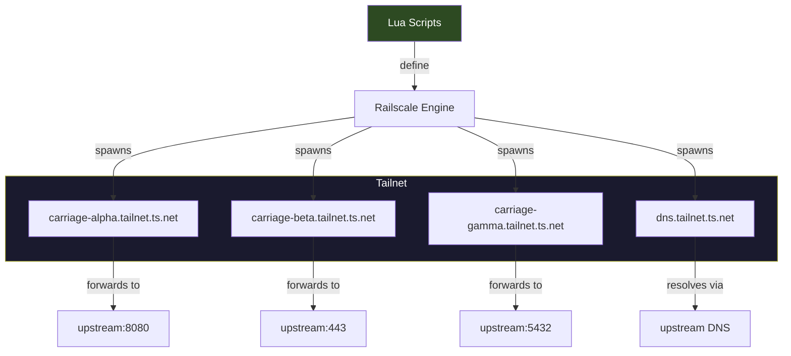
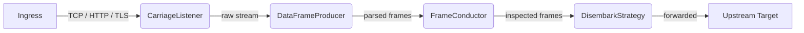

  

# Railscale

A scriptable, Tailscale-native network service. Lua scripts define **carriages** — independent Tailscale nodes, each with its own hostname and forwarding pipeline. Railscale reads the scripts and brings them to life on the tailnet.

## Architecture

## Carriage Pipeline

Each carriage spawned by a Lua script runs a four-stage pipeline:

| Stage | Trait | Role |
|-------|-------|------|
| **Listen** | `CarriageListener` | Accept connections on this carriage's tailnet address |
| **Parse** | `DataFrameProducer` | Read and buffer frames from the connection |
| **Inspect** | `FrameConductor` | Evaluate frames — pass, reject, or transform |
| **Forward** | `DisembarkStrategy` | Write frames to the upstream destination |

## Key Concepts

- **Lua scripts** -- the source of truth. They declare carriages, their hostnames, ingress types, and forwarding targets. Railscale is the runtime that executes them.
- **Carriage** -- a self-contained Tailscale service with its own hostname and forwarding pipeline, defined in Lua
- **DNS Server** -- a separate Tailscale service for DNS forwarding, also defined in Lua
- **rsnet** -- Rust Tailscale integration; each carriage gets its own `rsnet` instance
